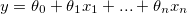
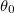
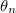
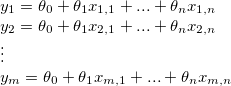
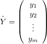
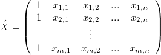
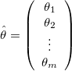
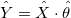
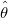
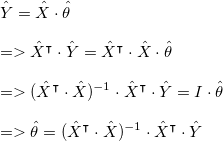

# Linear Regression with Multiple Parameters Solved Analytically

Let's say we want to find the line with following equation:

<div style="text-align:center"></div>

We have m samples in our training set (ie we know m `y`s for real-world `x` values) so the training data takes the following form where  to  are unknown:  

<div style="text-align:center"></div>

Let's define the following matrices: 

<div style="text-align:center"></div>

<div style="text-align:center"></div>

<div style="text-align:center"></div>

Then we can define our problem with the following matrix equation: 

<div style="text-align:center"></div>

To solve for :

<div style="text-align:center"></div>


Code: 


```scala
  type Matrix = IndexedSeq[IndexedSeq[Double]]

  def solve(x: Matrix, y: Matrix): Matrix = {
    val xT = x.transpose
    val yT = y.transpose
    ((xT dot x).inverse dot xT) dot y
  }
```

Auxillary methods are [here](https://github.com/polyglotpiglet/catistics/blob/master/src/main/scala/com/ojha/core/MatrixUtil.scala) on my github. 