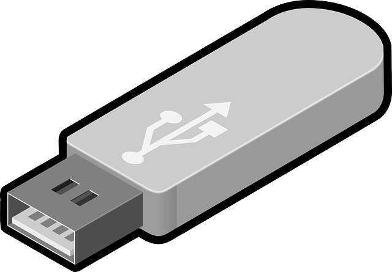
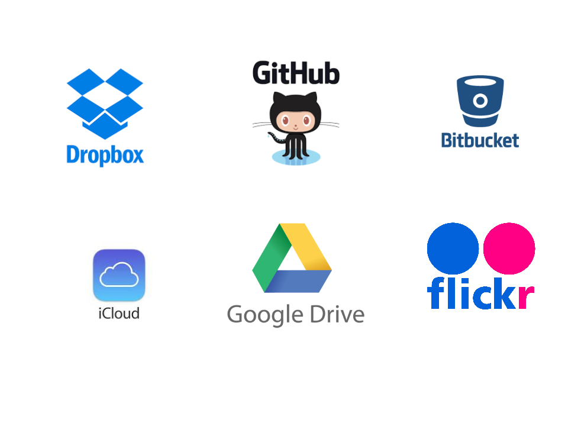

# Automating Setup of Local Environment: Why and How 

## Contents
1. Introduction
2. Motivation
3. Tools of the trade
	* Homebrew and Cask
	* Ansible
	* VCSH
	* MR

## Introduction

## Motivation

When I was at school we had to do coursework and, except for one handwritten assignment for GCSE English, everything was done on the computer. Now, this was before fantastic tools like Google Docs and Dropbox were popular and everybody had one of these:

You would carry this around with you, plugging it into school computers and your home computer (which was probably brand new and shared with your entire faimly) and all the teachers would say the same thing: 

There would always be a horror story about some poor soul who had lost her USB pen and had to redo her coursework in half a dozen subjects. She didn't sleep for a week or didn't get in to any universities, depending on who you spoke to, and so it was drilled into all of us:

<b>IF IT'S IMPORTANT THEN BACK IT UP</b>

Fortunately, these days many things are backed up for us. 

All of my pictures and music are on iCloud. If I want to check when my TV licence is up for renewal I will search through Gmail for the last confirmation email I received. I log into my Amazon account for my address history. So much of our data is stored online for us so these days we aren't terribly worried about backing things up ourselves. 

However, one thing that more often that not nobody bothers to automate the setup of their environment and, really, why would you bother? How often do you buy a new machine? Every couple of years? 

However, there are some good reasons for automating the setup:

* I have a home machine and a work machine. I like to maintain idempotent setup scripts to ensure my environments are in sync. This includes making changes to (eg) my .vimrc file on one machine and having the changes available easily and quickly on my other machine

* Sometimes you do get a new machine! When I started at ITV my laptop hadn't arrived so I had a temporary machine then 3 days after I joined I got another one which I setup in 45 minutes, most of which was waiting for downloads. 

* Your name is Gary and you work in my office and you often need a new laptop because you think this is a good place to store your pen and you forget that the pen is there when you close the laptop: 

## Tools of the Trade

### Brew and cask

[Homebrew] (http://brew.sh/) is a package manager for OS X and as far as I am aware you can install only command line software with homebrew. The [Cask] (https://caskroom.github.io/) project extends homebrew and is used mainly for installing GUI applications. 

However, let's not talk about brew without talking about ...

### ... Ansible

Ok so you might have heard about ansible being used to provision clusters of nodes in some distributed environment but it's also useful for the small stuff. The ansible homebrew plugin is smart enough to check if the appliction is installed, giving it an advantage over a shell script where every line starts with 'brew install ... '. 

Similarlly, it's clever enough to check whether or not it needs to bother copying a config file by hashing the file contents and seeing if they match a file with the same name in the destination repository. 

It also comes with neat tagging so you don't have to rerun your entire script every time you want to do something. All of this is possible with bash scripts and homebrew but why reinvent the wheel? 

My basic ansible installation script is [here](https://github.com/polyglotpiglet/home-office-setup/blob/master/playbook.yml). Note that this is very much a work in progress because this kind of automation is not something that I would sit and spend a couple of days doing. Instead, every time I touch these scripts I try to follow the boy scout rule: 'Always leave the campsite a little bit better than the way that you found it'.  

### VCSH

You have a lot of dot configs, right? When you are setting up your new environment you want all of these to be in your home directory, but your home directory is not a git repo. What to do, what to do?

Vcsh is an awesome little tool which allows you to checkout multiple git repos into the same directory. 

### MR

MR or 'my repos' allows you to apply git functions to multiple git repos at once. Very useful for syncing all your dot configs in one go or pushing all your changes across multiple repos to github after coding offline. It might not sound like a lot but if you take care of the seconds then the minutes take care of themselves. 

For details about setting up vcsh with mr take a look at [this] (http://alexandrastech.blogspot.com/2016/04/vcsh-with-myrepos-mr.html) blog post.

