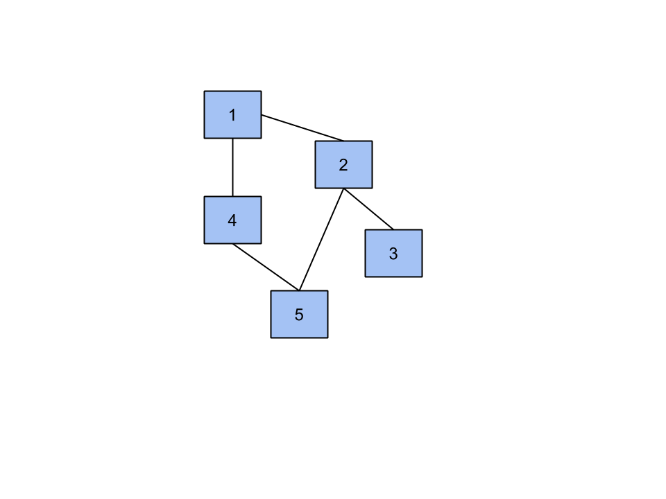

# Graphs

## Graph Modelling

There are two main ways to model a graph and we will illustrate both for the following example graph: 



### 1. Adjacency List

Each node maintains a list of its ingoing or outgoing (or undirected as is the case above) connections.

```
1 {2,4}
2 {1,3,5}
3 {2}
4 {1,5}
5 {2,4}

```

### 2. Adjacency Matrix

An ***n x n*** matrix, ***M***, of ones and zeros where ***n*** is the number of nodes in the graph. M_(i,j) = 1 if there exists an edge between node i and node j in the graph. 

```
0 1 0 1 0
1 0 1 0 1
0 1 0 0 0 
1 0 0 0 1
0 1 0 1 0
```

 
