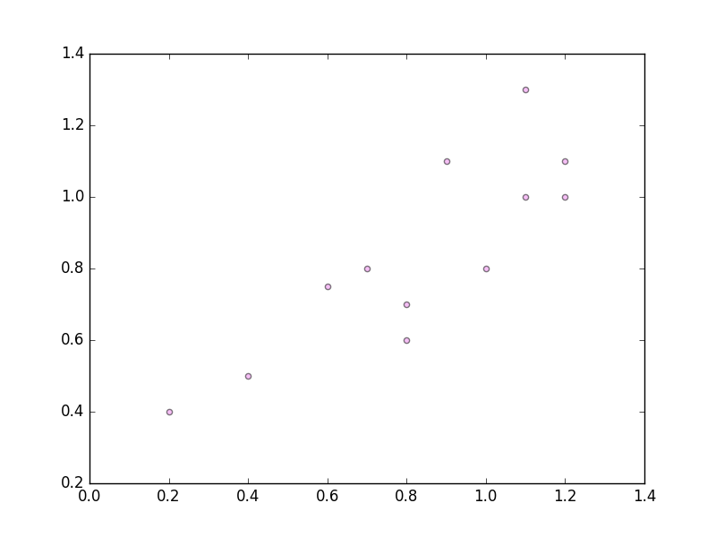
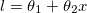
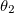
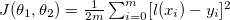
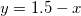
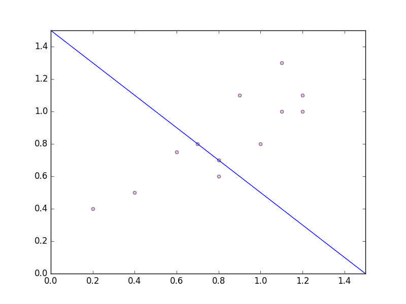
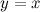
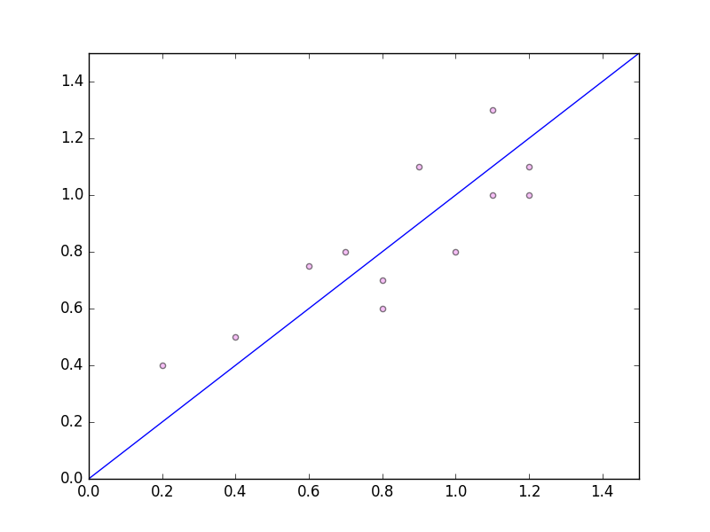

# Introduction to Gradient Descent

## Example Training Set

Imagine we have some correlated data []

```
x = [1, 1.1, 0.8, 0.2, 1.2, 0.9, 1.1, 1.2, 0.4, 0.7, 0.8, 0.6]

y = [0.8, 1.0, 0.7, 0.4, 1.1, 1.1, 1.3, 1.0, 0.5, 0.8, 0.6, 0.75]
```



## Goal

We want to plot a _'line of best fit'_ for this data. 

This will be some line of the following form:

<div style="text-align:center"></div>

For a given  and , and where _m_ is the size of the data set, we define a _cost_ function:

<div style="text-align:center"></div>

Consider the line  , shown the in following diagram: 

<div style="text-align:center"></div>

Clearly this is a terrible fit for the data. If we calculate the cost value for this line it equals `0.1601041666666667`. 

However consider the line . This line fits the data better and so the cost values is lower: `0.013020833333333336`. 

<div style="text-align:center"></div>

Intuitively, we want to find the minimum of the cost function, which will give us the most appropriate values for  and . 

## Gradient Descent Algorithm

1. Choose a random point 
2. Check the gradient at this point
3. Take a step in the right direction

## Code for Calculating Cost Function

```scala
object Cost extends App {

  val xs = Array(1,1.1,0.8,0.2,1.2,0.9,1.1, 1.2,0.4, 0.7, 0.8, 0.6)
  val ys = Array(0.8, 1.0, 0.7, 0.4, 1.1, 1.1, 1.3, 1.0, 0.5, 0.8, 0.6, 0.75)

  def computeCost(theta1: Double, theta2: Double): Double = {
    val hypothesises = xs.map(x => theta1 + theta2 * x)
    val summedSquareDiffs = (hypothesises, ys).zipped
    											.map(_ - _)
    											.map(math.pow(_, 2))
    											.sum
    summedSquareDiffs / (2 * xs.length)
  }

  println(computeCost(1.5, -1)) // bad line
  println(computeCost(0, 1)) // better line
}
```