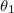

# Introduction to Gradient Descent

## Example Training Set

Imagine we have some correlated data  with the following values:

```
x = [1, 1.1, 0.8, 0.2, 1.2, 0.9, 1.1, 1.2, 0.4, 0.7, 0.8, 0.6]

y = [0.8, 1.0, 0.7, 0.4, 1.1, 1.1, 1.3, 1.0, 0.5, 0.8, 0.6, 0.75]
```


## Goal

We want to plot a _'line of best fit'_ for this data. 

This will be some line of the following form:

<div style="text-align:center"></div>

For a given  and , and where _m_ is the size of the data set, we define a _cost_ function, which is a measure of how well the line fits the data:

<div style="text-align:center"></div>

Consider the line  , shown the in following diagram: 

<div style="text-align:center"></div>

Clearly this is a terrible fit for the data. If we calculate the cost value for this line it equals `0.1601041666666667`. 

However consider the line . This line fits the data better and so the cost values is lower: `0.013020833333333336`. 

<div style="text-align:center"></div>

Intuitively, we want to find the minimum of the cost function, which will give us the most appropriate values for  and . 

## Gradient Descent Algorithm

Choose a random line, eg 

Then the gradient descent algorithm is the following: 


Let's calculate these partial derivatives: 


<div style="text-align:center"></div>

(Hopefully now you can see why we had that factor of 2 in the cost factor denominator. It neatened up the partial derivatives nicely.)

## Implementation of Gradient Descent Algorithm

```scala
 val file = new File("/Users/alexbate/polyglotpiglet/blogs/gradientDescent/results/alphaZeroPoint1AndIterationsEquals100.txt")
  val bw = new BufferedWriter(new FileWriter(file))

  val alpha = 0.1
  val (theta1, theta2) = (0 to 100)
  							.foldLeft((0.0, 0.0)){ case ((t1, t2), _) => {
    	bw.write(computeCost(t1, t2).toString + "\n")
    	(nextTheta1(t1, t2, alpha, xs, ys), nextTheta2(t1, t2, alpha, xs, ys))
  }}
  bw.close()

  println(s"Theta1: $theta1, Theta2: $theta2")

  def y(theta1: Double, theata2: Double, x: Double): Double = theta1 + theata2 * x

  def nextTheta1(theta1: Double, 
  					theta2: Double, 
  					alpha: Double, 
  					xs: Array[Double], 
  					ys: Array[Double]): Double = {
    val partial = xs.zip(ys)
    				.map(pair => y(theta1, theta2, pair._1) - pair._2)
    				.sum / xs.length
    theta1 - alpha * partial
  }

  def nextTheta2(theta1: Double, 
  					theta2: Double, 
  					alpha: Double, 
  					xs: Array[Double], 
  					ys: Array[Double]): Double = {
    val partial = xs.zip(ys)
    				.map(pair => (y(theta1, theta2, pair._1) - pair._2) * pair._1)
    				.sum / xs.length
    theta2 - alpha * partial
  }
```

## Results

I plotted the value of the cost values for each iteration: 

<div style="text-align:center"></div>

We can see that the cost value converges quickly towards a minimum. 

Running for 10000 iterations the end values of  and  are `0.238855421686753` and `0.7183734939758966` respectively. This will be interesting for when we come to compute them analytically in a later post. 

## Code for Calculating Cost Function

```scala
object Cost extends App {

  val xs = Array(1,1.1,0.8,0.2,1.2,0.9,1.1, 1.2,0.4, 0.7, 0.8, 0.6)
  val ys = Array(0.8, 1.0, 0.7, 0.4, 1.1, 1.1, 1.3, 1.0, 0.5, 0.8, 0.6, 0.75)

  def computeCost(theta1: Double, theta2: Double): Double = {
    val hypothesises = xs.map(x => theta1 + theta2 * x)
    val summedSquareDiffs = (hypothesises, ys).zipped
    											.map(_ - _)
    											.map(math.pow(_, 2))
    											.sum
    summedSquareDiffs / (2 * xs.length)
  }

  println(computeCost(1.5, -1)) // bad line
  println(computeCost(0, 1)) // better line
}
```