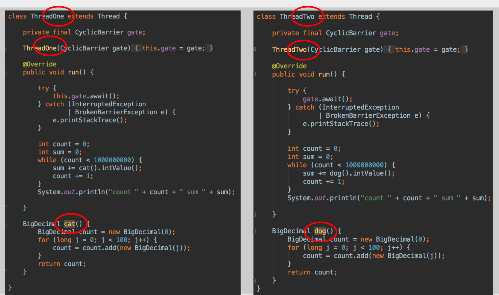
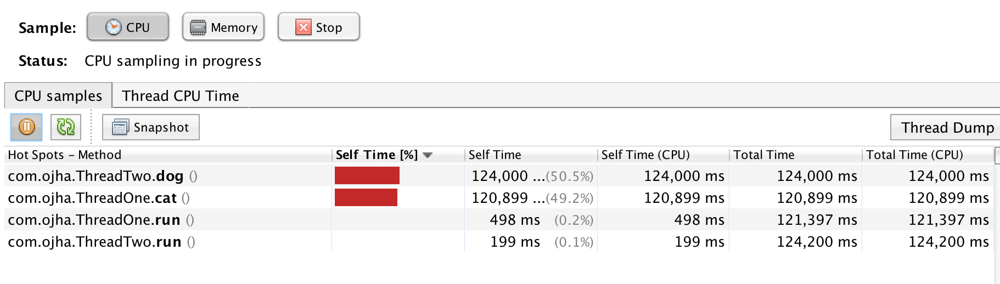
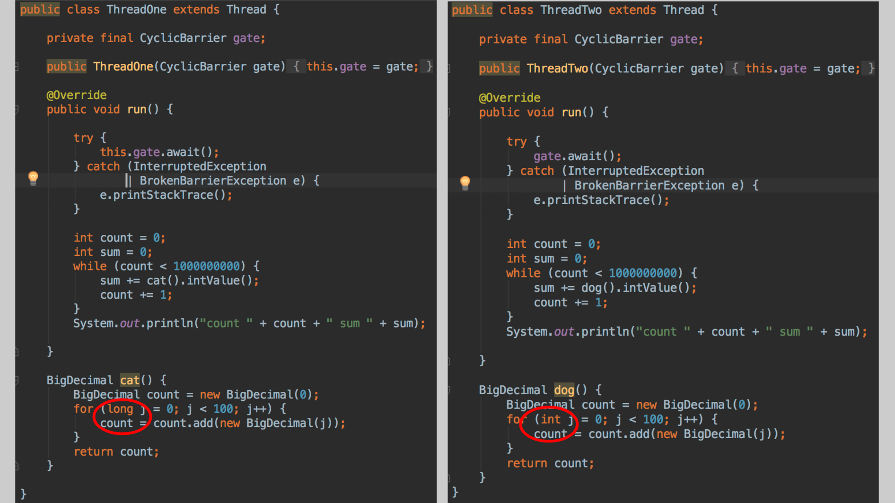
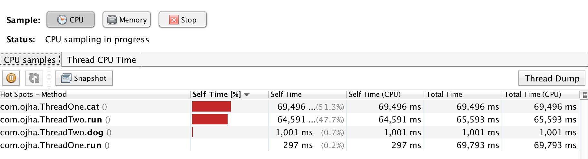
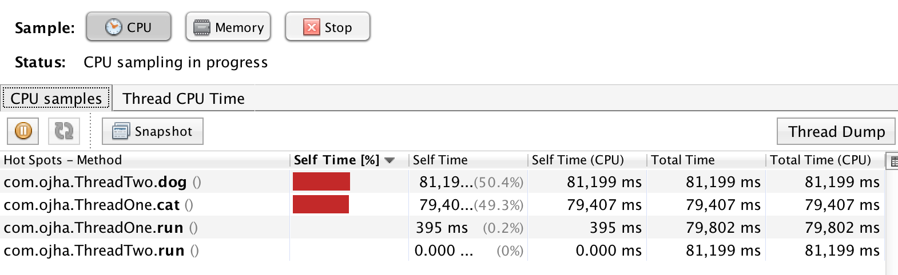
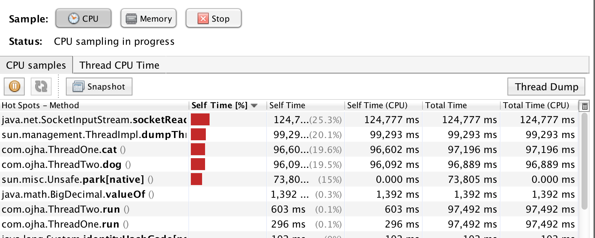

# Big fat lies: VisualVM 

Here is a main method that starts two threads: 

```scala
    public static void main(String... args) throws BrokenBarrierException, InterruptedException {
        final CyclicBarrier gate = new CyclicBarrier(3);

        ThreadOne one = new ThreadOne(gate);
        ThreadTwo two = new ThreadTwo(gate);

        one.start();
        two.start();

        gate.await();
    }
```

## Version 1

Let's look at these threads:
(I've taken a screenshot because it's easier to compare the two but the real, copy-and-pasteable code is at the bottom of this post). 



The code is identical except the names of the classes differ (ThreadOne and ThreadTwo respectively) and that ThreadOne's run method calls 'cat' and ThreadTwo's run method calls 'dog'. However the code in the cat and dog methods are completely identical. 

Let's run this code and profile it using VisualVm's sampling capability. 

I left it running for a few mins and this is what VisualVM came up with as the hot methods: 

 

Pretty sensible innit! Most of the time is spent equally between the cat and dog methods while it's churning away. 

## Version 2

Now what happens if we change the loop inside the dog method so that it is indexed by an int rather than a long? 

 

Let's profile it: 



Now the dog method doesn't register and the time is split approximately equally between ThreadTwo's run method and ThreadOne's cat method! 

This is because in loops indexed by longs there is a safepoint poll during every iteration of the long loop. The int loop, other the other hand, is an 'uncounted' loop; the JVM assumes that loops indexed by ints are fairly short and doesn't insert a safepoint check in the loop. That means that there are more safepoint checks in the cat method than in the dog method so the cat method is more frequently sampled that the dog method. 

## Version 3

The code is the same as in version 2 but we add the following JVM flag: 

` -XX:CompileCommand=exclude,com/ojha/ThreadTwo.dog`

This is basically telling the JVM not to bother compiling that method (ie let it be interpreted every time). 

Now we see the following result: 



This is because there is a safepoint poll between lines of bytecode so now dog method has a lot more safepoint polls so the probability of dog and cat being sampled evens out a bit. 

## Version 4

Note that by default my VisualVM is ignoring the following packages: 

```
java.*, javax.*,
sun.*, sunw.*, com.sun.*,
com.apple.*, apple.awt.*, apple.laf.*

```

If I disable this (so it profiles everything) and I run Version 1 again (ThreadOne and ThreadTwo identical except method names) then I see the following:



There are two ways to fix performance problems: either by making a method faster or reducing the frequency with which you call a method (or both). Sampling all the packages means you can see useful stuff like all that ThreadImpl.dumpThread-ing that it's doing which is useful for tackling the latter. 

## How to find polls

`-XX:+UnlockDiagnosticVMOptions -XX:+PrintAssembly`

 {poll} in the output refers to a loop poll and {poll_return} is a poll at method return. 


## Code

ThreadOne (cat)

```scala
import java.math.BigDecimal;
import java.util.concurrent.BrokenBarrierException;
import java.util.concurrent.CyclicBarrier;

class ThreadOne extends Thread {

    private final CyclicBarrier gate;

    ThreadOne(CyclicBarrier gate) {
        this.gate = gate;
    }

    @Override
    public void run() {

        try {
            this.gate.await();
        } catch (InterruptedException
                | BrokenBarrierException e) {
            e.printStackTrace();
        }

        int count = 0;
        int sum = 0;
        while (count < 1000000000) {
            sum += cat().intValue();
            count += 1;
        }
        System.out.println("count " + count + " sum " + sum);

    }

    BigDecimal cat() {
        BigDecimal count = new BigDecimal(0);
        for (long j = 0; j < 100; j++) {
            count = count.add(new BigDecimal(j));
        }
        return count;
    }
}
```

ThreadTwo (dog)

```scala
import java.math.BigDecimal;
import java.util.concurrent.BrokenBarrierException;
import java.util.concurrent.CyclicBarrier;

class ThreadTwo extends Thread {

    private final CyclicBarrier gate;

    ThreadTwo(CyclicBarrier gate) {
        this.gate = gate;
    }

    @Override
    public void run() {

        try {
            gate.await();
        } catch (InterruptedException
                | BrokenBarrierException e) {
            e.printStackTrace();
        }

        int count = 0;
        int sum = 0;
        while (count < 1000000000) {
            sum += dog().intValue();
            count += 1;
        }
        System.out.println("count " + count + " sum " + sum);

    }

    BigDecimal dog() {
        BigDecimal count = new BigDecimal(0);
        for (long j = 0; j < 100; j++) {
            count = count.add(new BigDecimal(j));
        }
        return count;
    }
}
```