# Introduction to Logistic Regression (probability of binary result)

Let's say that we want to classify something into two categories. For example given some metadata about a person (such as size of house, age) that person may or may not own a cat. 

Given some initial training data, where we have all this information about a number of people with and without cats, we want to be able to use this existing data to build prediction model to determine whether someone has a cat. 

We will find some hypothesis function which takes in the metadata as a parameter and outputs a value between 0 and 1, which we can interpret as the probability that the person owns a cat. 

Our hypothesis will be of the following form ('sigmoid' or 'logistic' function): 

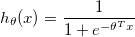

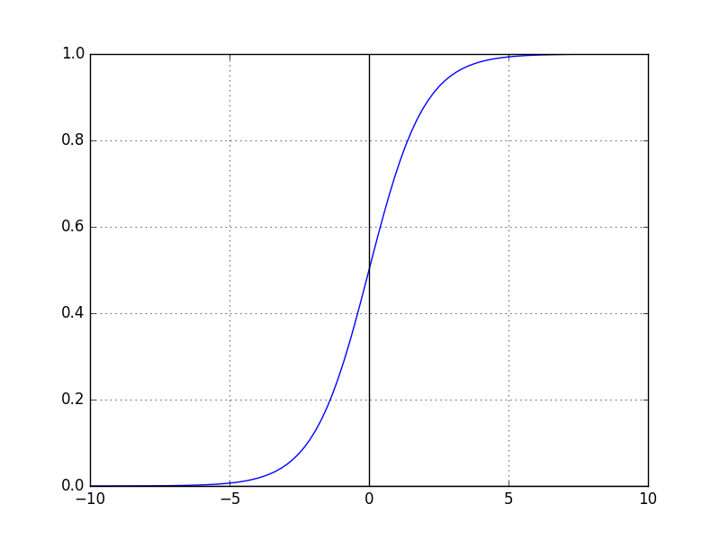

As expected, it produces values between 0 and 1. 0 indicated that it's very unlikely that the person owns a cat and 0.5 indicates that there is a 50% chance that they own a cat. 

### Cost

For a given hypothesis function, 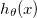, where 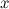 is the metadata, then we want to define a 'cost function ' which is essentially a measure of the accuracy of our hypothesis. We know the real value for 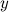 for this metadata from our trainig set (note that it's value is 0 or 1). If our hypothesis gives us a wildly different value for  than the real value then it should have a very high cost. If it's very close then it should have a very small cost. 

Consider the following cost function:

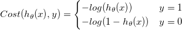

Plotting 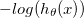 (cost function when  is 1) between 0 and 1:

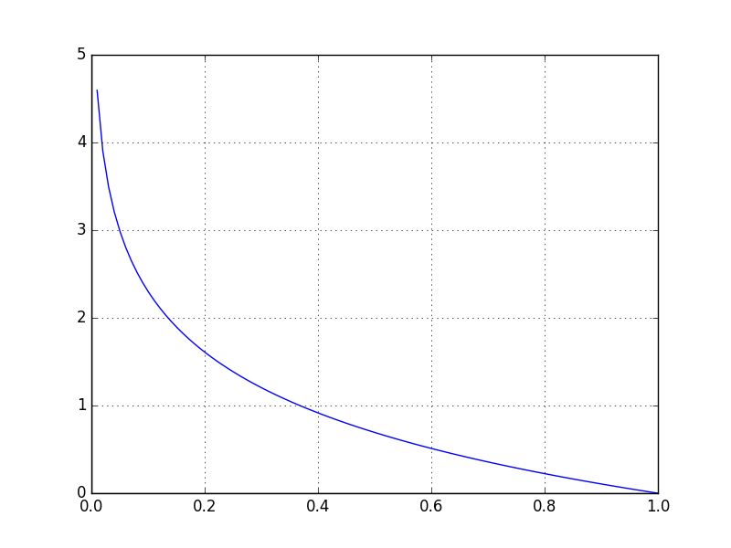

Clearly if 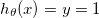 then the cost is 0. If they differ completely then the cost is infinite. 

Plotting 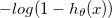 (cost function when  is 0) between 0 and 1:

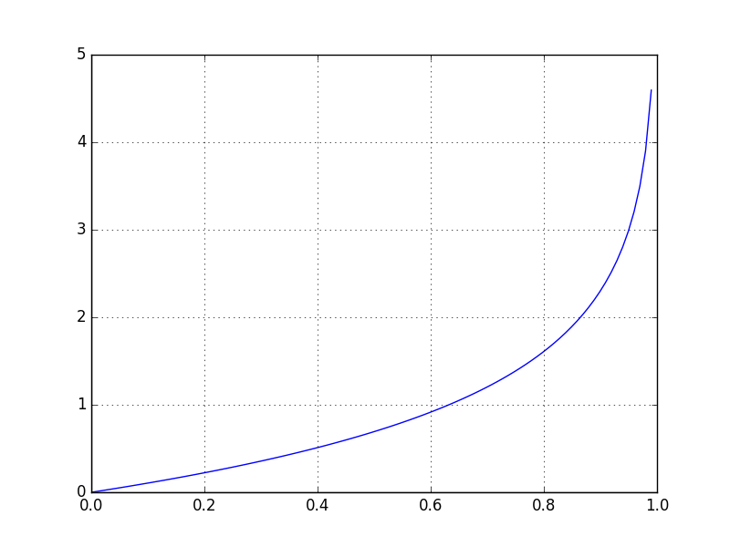

This is also clearly a good cost function. 

We can tidy up this cost function into one neat equation so that we don't have the two cases:

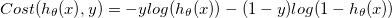

If we have _n_ entries in our training data then the total cost across the entire traiing set is the following: 

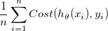

We need to choose theta such that this cost function is minimised. 

