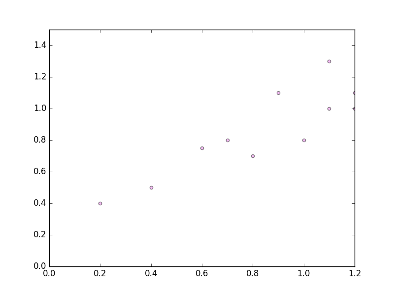
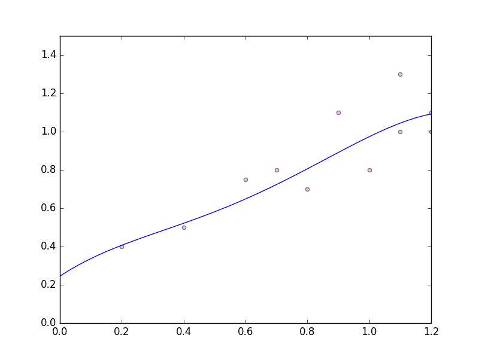
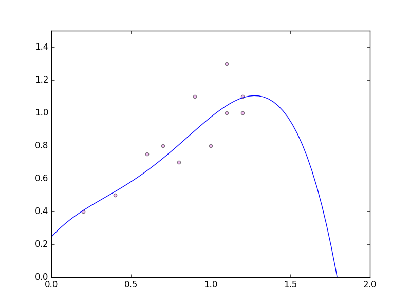
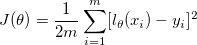
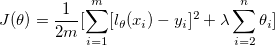

# Overfitting

In a [previous post](<https://github.com/polyglotpiglet/blogs/blob/master/multivariateGradientDescent/Multivariate.md>) we saw how we can use gradient descent to find polynomial curves to fit some sample data. 

Consider the following data set:

<div style="text-align:center"></div>

Let's try to find a curve of the following form: 

<div style="text-align:center"></div>

(You might wonder why are we trying to find a polynomial when the data looks sort of linear. Well, we only know it's linear because we are eyeballing it, but that really doesn't scale. We want to find a solution that will work automagically.) 

Using the code from the previous post to execute gradient descent we compute the following results: 

```
theta1 = 0.24522210175513323
theta2 = 1.0684296895629888
theta3 = -1.7556623273903793
theta4 = 2.4372319164446665
theta5 = -1.0215605651849788
```

These results for theta have the a cost of `0.00916092119437501`. Awesome, right?! That cost (computed using least squares check) is so tiny! 

Let's plot this curve: 

<div style="text-align:center"></div>

It looks ok. Let's look a little further along the x-axis: 

<div style="text-align:center"></div>

Oh no! Although this has fit the training set quite well, it's actually going to be terrible if we try and find a bigger the prediction where x = 1.25 or above. 

This problem is 'overfitting'. 

### How to solve: Regularision

Basically we want to find small values for theta, which make the result less prone to overfitting. To ensure we find small values for theta, we should make theta part of our cost function. 

Previously this was our cost: 

<div style="text-align:center"></div>

(where the number of data points in the training set = m)

Now that we want to incorporate the value of theta into our cost we modify this function: 

<div style="text-align:center"></div>

Note that by convention we actually normally don't count  in this sum at the end.


### Code

```scala
 val alpha = 0.01

  val xs = Array(1,1.1,0.8,0.2,1.2,0.9,1.1, 1.2,0.4, 0.7, 0.8, 0.6)
                  .map(x => Array(1, x, math.pow(x, 2), math.pow(x, 3), math.pow(x, 4)))
  val ys = Array(0.8, 1.0, 0.7, 0.4, 1.1, 1.1, 1.3, 1.0, 0.5, 0.8, 0.6, 0.75)

  val resultTheta = (0 to 10000000)
      .foldLeft(Array.fill(xs.head.length)(0.0)){
        case (theta,_) => theta.indices.map(i => nextTheta(i, theta, alpha, xs, ys)).toArray
      }

  resultTheta.zipWithIndex.foreach{ case (t, i) => println(s"theta${i+1} = $t")}
  println(computeCost(resultTheta, xs))

  def yEquals(theta: Array[Double], x: Array[Double]): Double = theta.zip(x).map(p => p._1 * p._2).sum

  // partial derivative
  def nextTheta(index: Int,
                theta: Array[Double],
                alpha: Double,
                xs: Array[Array[Double]],
                ys: Array[Double]): Double = {
    val sum = xs.zip(ys).map{ case (x, y) => (yEquals(theta, x) - y) * x(index) }.sum
    theta(index) - (alpha * sum) / ys.length
  }

  def computeCost(theta: Array[Double], xs: Array[Array[Double]]): Double = {
    val hypothesises = xs.map(x => yEquals(theta, x))
    val summedSquareDiffs = (hypothesises, ys).zipped
      .map(_ - _)
      .map(math.pow(_, 2))
      .sum
    summedSquareDiffs / (2 * xs.length)
  }
```
