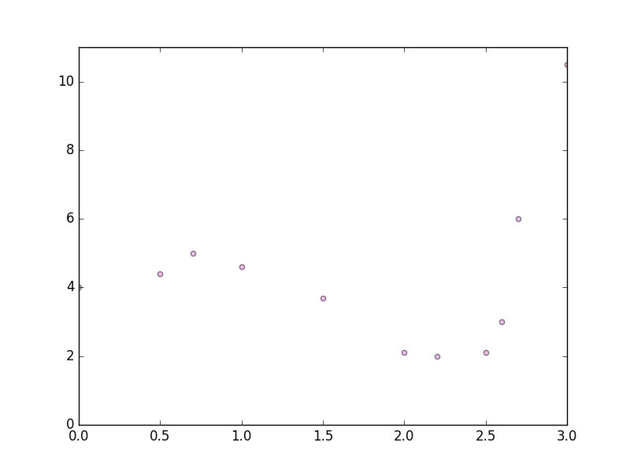
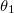
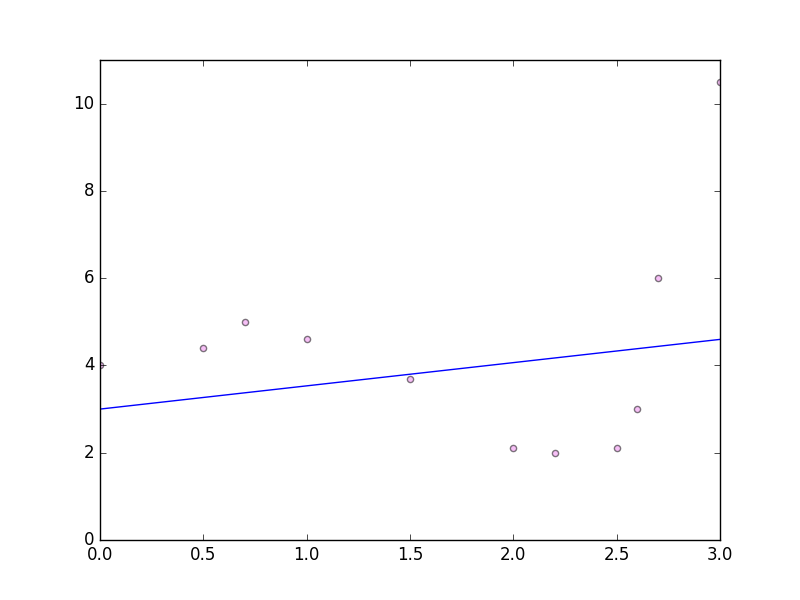
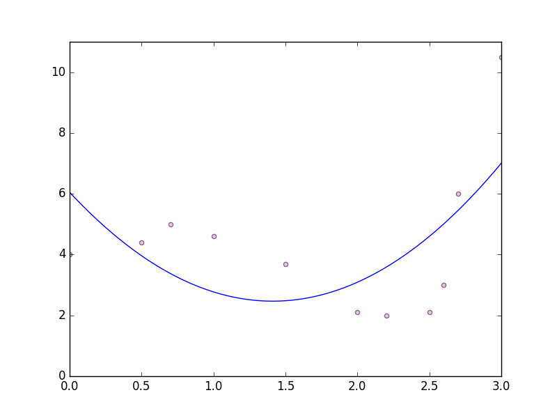
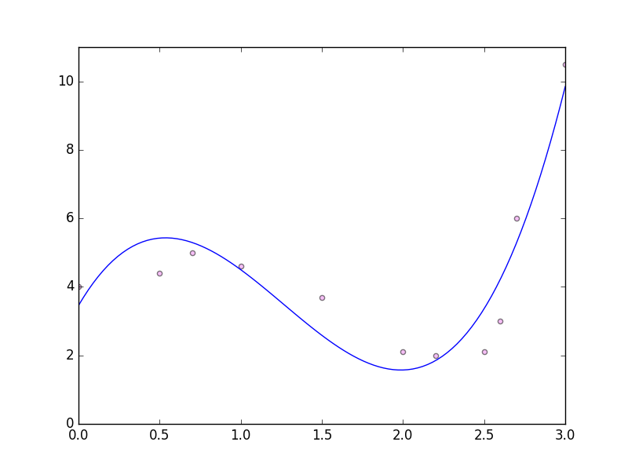
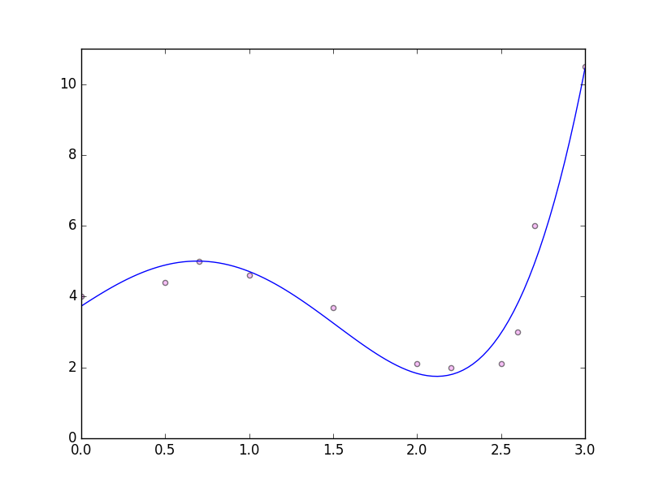

# Multivariate Gradient Descent

Let's take some sample data: 

```
x = (0, 0.5, 0.7, 1.0, 1.5, 2.0, 2.2, 2.5, 2.6, 2.7, 3.0)
y = (4, 4.4, 5.0, 4.6, 3.7, 2.1, 2.0, 2.1, 3.0, 6.0, 10.5)
```

<div style="text-align:center"></div>

Reminder of my gradient descent code: 

```scala
  val alpha = 0.1

  val xs = Array(0, 0.5, 0.7, 1.0, 1.5, 2.0, 2.2, 2.5, 2.6, 2.7, 3.0)
                .map(x => Array(1,x))
  val ys = Array(4, 4.4, 5.0, 4.6, 3.7, 2.1, 2.0, 2.1, 3.0, 6.0, 10.5)

  val resultTheta = (0 to 1000000)
      .foldLeft(Array.fill(xs.head.length)(0.0)){
        case (theta,_) => theta.indices.map(i => nextTheta(i, theta, alpha, xs, ys)).toArray
      }

  println(resultTheta.mkString(" "))

  def yEquals(theta: Array[Double], x: Array[Double]): Double = theta.zip(x).map(p => p._1 * p._2).sum

  // partial derivative
  def nextTheta(index: Int, 
                theta: Array[Double], 
                alpha: Double, 
                xs: Array[Array[Double]], 
                ys: Array[Double]): Double = {
    val sum = xs.zip(ys).map{ case (x, y) => (yEquals(theta, x) - y) * x(index) }.sum
    theta(index) - (alpha * sum) / ys.length
  }
```

Firstly, let's find a line of the form . Running this code gives  = 3.5495164410057947 and  = 0.44680851063830135. 

Plotting that: 

<div style="text-align:center"></div>

Not amazing is it. 

Try for quadratic curve: 

<div style="text-align:center"></div>

Power of three: 

<div style="text-align:center"></div>

Power of four: 

```scala
 val xs = Array(0, 0.5, 0.7, 1.0, 1.5, 2.0, 2.2, 2.5, 2.6, 2.7, 3.0)
                .map(x => Array(1, x, math.pow(x, 2)/9, math.pow(x, 3)/27, math.pow(x, 4) / 81))
```

(Note that I am applying some feature scalaing here with the dividing by 9, 27 etc.)

<div style="text-align:center"></div>

Isn't this a beautiful fit for the data! 